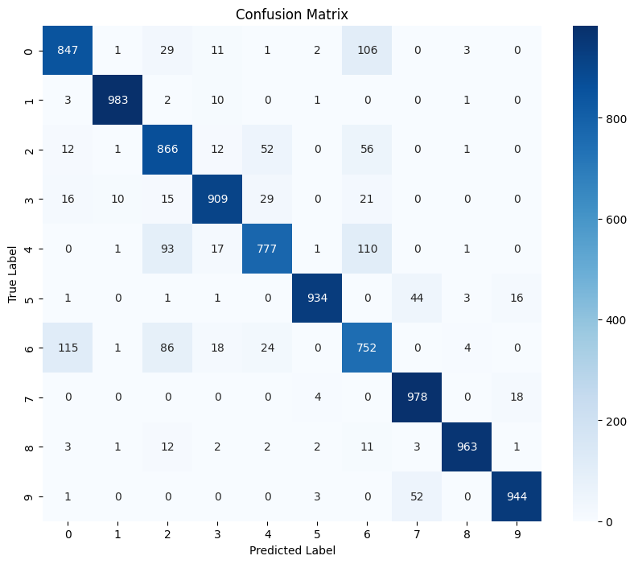
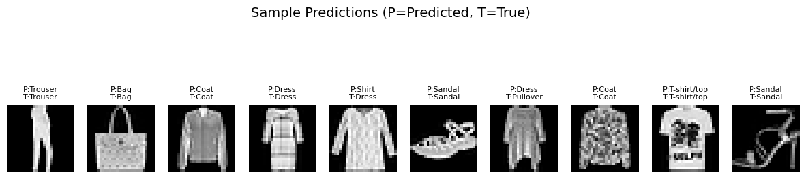
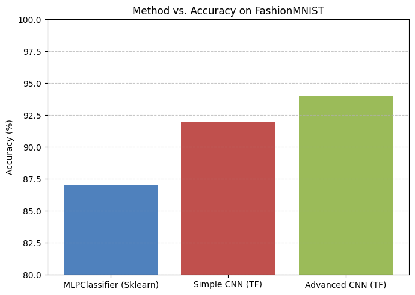

## Results Visualizations

Below are key visualizations generated by the notebook:

### Confusion Matrix
Shows the number of correct and incorrect predictions for each class, helping to identify which classes are most often confused.

### Sample Predictions
Displays random test images with both predicted and true labels, providing a qualitative sense of model performance.

### Method vs. Accuracy
A bar chart comparing the accuracy of each method used in this project.

> **Note:** If the images above do not appear, make sure to export the relevant plots from the notebook and save them in an `images/` folder in your repository.
## Summary of Findings

- **Baseline MLPClassifier (Scikit-learn):** Achieved ~87% accuracy. This demonstrates the limitations of simple, fully connected neural networks for image data, as they do not capture spatial features well.
- **Simple CNN (TensorFlow/Keras):** Achieved ~92% accuracy. The use of convolutional layers allows the model to learn spatial hierarchies, significantly improving performance over the MLP.
- **Advanced CNN with Data Augmentation:** Achieved up to ~94% accuracy. Data augmentation (random rotations, shifts, zoom) and regularization (dropout, early stopping) improved generalization and reduced overfitting.
- **Confusion Matrix:** Used to visualize the number of correct and incorrect predictions for each class. This helps identify which classes are most often confused by the model, revealing strengths and weaknesses beyond overall accuracy.
- **Predicted vs. True Diagram (Sample Predictions):** Shows random test images with both predicted and true labels. This provides a qualitative sense of model performance, highlights specific successes and failures, and helps spot systematic errors (e.g., confusing similar clothing items).

# FashionMNIST_ImageClassification

This project demonstrates image classification on the FashionMNIST dataset using both traditional machine learning and advanced deep learning techniques. It includes:

- **Baseline MLPClassifier**: A simple neural network using Scikit-learn for quick benchmarking.
- **Advanced CNN**: A high-accuracy Convolutional Neural Network built with TensorFlow/Keras, featuring data augmentation, dropout, and early stopping for improved generalization.

## Workflow
1. **Data Download**: Automatically downloads the FashionMNIST dataset using `kagglehub`.
2. **Preprocessing**: Loads data into pandas DataFrames, separates features/labels, and normalizes pixel values.
3. **Model Training**:
	- Trains a baseline MLPClassifier (Scikit-learn).
	- Trains a simple CNN, then an improved CNN with data augmentation and regularization (TensorFlow/Keras).
4. **Evaluation**: Reports accuracy and displays confusion matrix and sample predictions.

## Usage
1. Open the `FashionMNIST_Scikit_90.ipynb` notebook in Jupyter or VS Code.
2. Run all cells in order. Required packages will be installed automatically.
3. Review the results and visualizations at the end of the notebook.

## Requirements
- Python 3.8+
- Jupyter Notebook or VS Code
- Packages: scikit-learn, matplotlib, seaborn, tensorflow, kagglehub, pandas, numpy

## Notes
- The advanced CNN section uses data augmentation and early stopping to maximize test accuracy and prevent overfitting.
- All code is commented for clarity and easy modification.